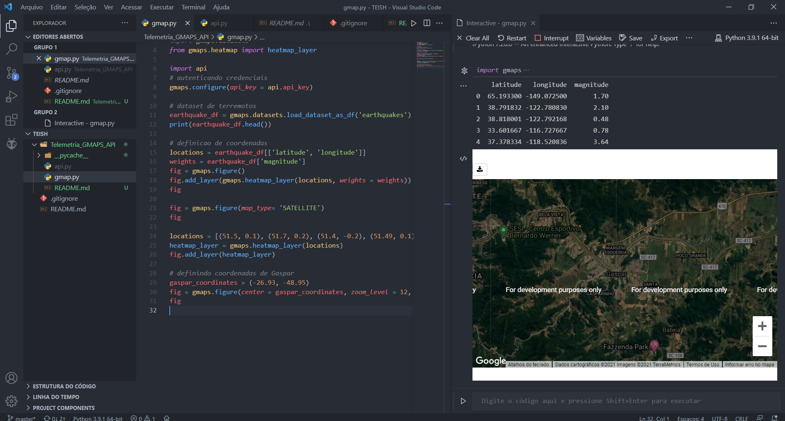

## Telemetria utilizando API do Google Maps

### Objetivo

Pequena demonstração da visualização de uma área no Google Maps utilizando recursos da API GMap e a linguagem Python.

### Resultados

Resultado gerado pelo Python.